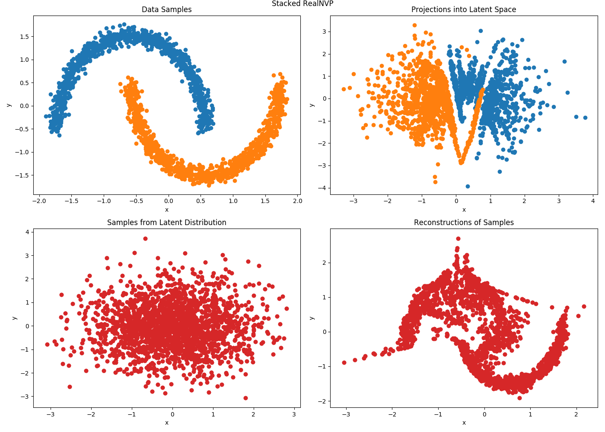
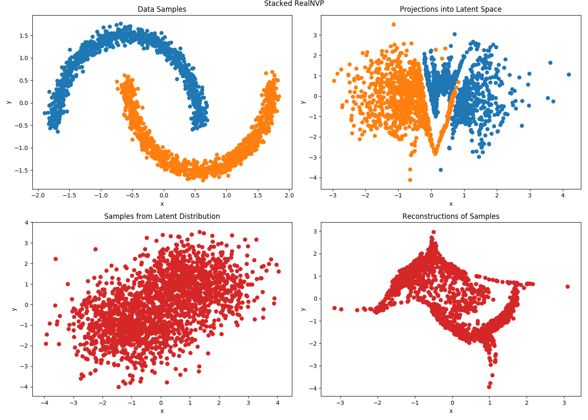

# Deep Generative Models
My PyTorch implementations of deep generative models.

## How to Use
The project is structured as such:

```
deepgenmodels/
- utils/
    - mixture_distribution
        - MixtureDistribution
- autoregressive/
    - nade
        - NADE
    - fvsbn
        - FVSBN
- normalizing_flows/
    - realnvp
        - RealNVP
        - RealNVPStacked
```

Thus, to import RealNVP, one would do:
```python
from deepgenmodels.normalizing_flows.realnvp import RealNVP
```

## Autoregressive Models
### Fully Visible Sigmoidal Belief Network (FVSBN)
<p align="center">
    </img>
</p>

### Neural Autoregressive Distribution Estimator (NADE)
<p align="center">
    </img>
</p>

## Flow Models
### Real-Valued Non-Volume Preserving Flows (RealNVP)
#### Original Formulation
Latent Distribution: Zero-Mean Unit-Variance Gaussian
<p align="center">
    </img>
</p>

#### Class-Conditioned Formulation
Latent Distribution: Mixture of Unit-Variance Gaussians Centered at [-1, -1] (Class 0) and [1, 1] (Class 1).
<p align="center">
    </img>
</p>
