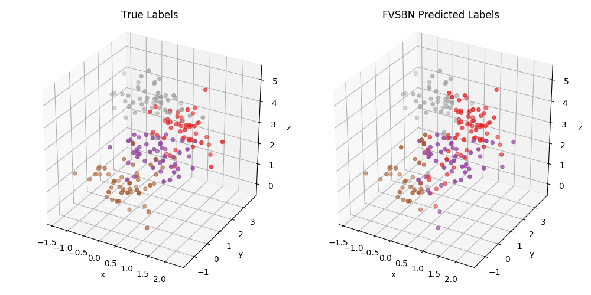
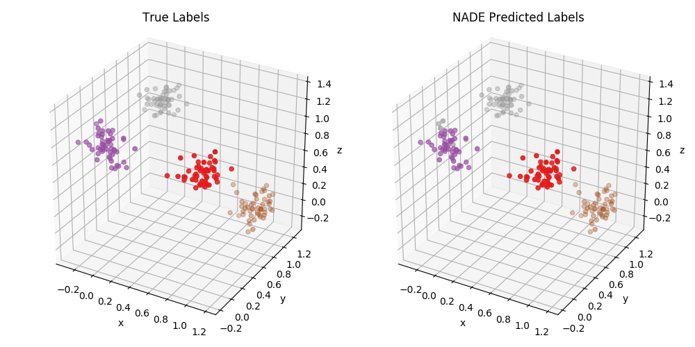

# Deep Generative Models
My PyTorch implementations of deep generative models.

## Autoregressive Models
### Fully Visible Sigmoidal Belief Network (FVSBN)

    </img>

### Neural Autoregressive Distribution Estimator (NADE)

    </img>

