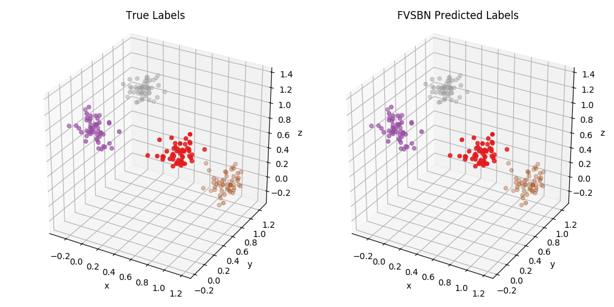

# Deep Generative Models
My PyTorch implementations of deep generative models.

## How to Use
The project is structured as such:

```
deepgenmodels/
- utils/
    - mixture_distribution
        - MixtureDistribution
- autoregressive/
    - nade
        - NADE
    - fvsbn
        - FVSBN
- normalizing_flows/
    - realnvp
        - RealNVP
        - RealNVPStacked
```

Thus, to import RealNVP (only one layer) and RealNVPStacked (multiple layers), one would do:
```python
from deepgenmodels.normalizing_flows.realnvp import RealNVP, RealNVPStacked
```

Note that to use the class-conditioned RealNVP, pass *class_condition=True* in the RealNVP constructor, and a *MixtureDistribution* as the *base_dist* parameter. An example:
```python
from torch.distributions import MultivariateNormal
from deepgenmodels.utils.mixture_distribution import MixtureDistribution

# Define distribution.
inp_dimensions = 4
dist = MixtureDistribution(dists=[
            MultivariateNormal(loc=torch.ones(inp_dimensions) * -1.0, covariance_matrix=torch.eye(inp_dimensions)),
            MultivariateNormal(loc=torch.ones(inp_dimensions) * +1.0, covariance_matrix=torch.eye(inp_dimensions)),
        ], dims=inp_dimensions)

# Define characteristics of each RealNVP layer.
num_layers = 3
layer_wise_dict = {
    layer_num: {
        'mu_net': deepcopy(mu_net),
        'sig_net': deepcopy(sig_net),
        'base_dist': dist,
        'dims': inp_dimensions,
        'class_condition': True,
    } for layer_num in range(num_layers)
}

# Create stacked RealNVP model.
model = RealNVPStacked(layer_wise_dict)
```

## Autoregressive Models
### Fully Visible Sigmoidal Belief Network (FVSBN)
<p align="center">
    </img>
</p>

### Neural Autoregressive Distribution Estimator (NADE)
<p align="center">
    </img>
</p>

## Flow Models
### Real-Valued Non-Volume Preserving Flows (RealNVP)
#### Original Formulation
Latent Distribution: Zero-Mean Unit-Variance Gaussian
<p align="center">
    </img>
</p>

#### Class-Conditioned Formulation
Latent Distribution: Mixture of Unit-Variance Gaussians Centered at [-1, -1] (Class 0) and [1, 1] (Class 1).
<p align="center">
    </img>
</p>
